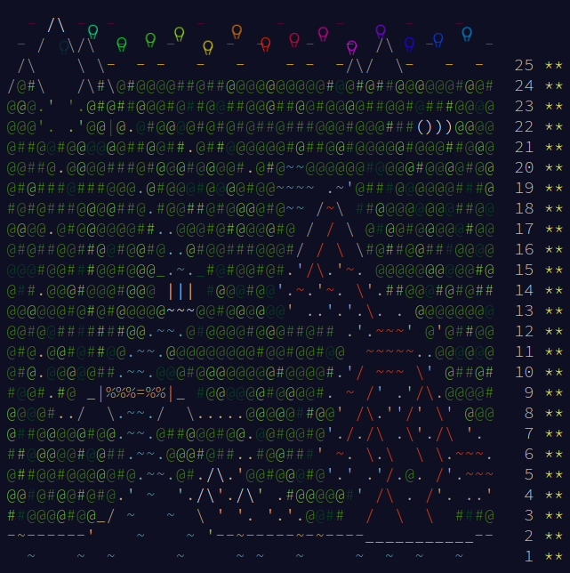

# aoc-2022-cpp

## About aoc-2022-cpp

Practice C++ with https://adventofcode.com/

## More Details

 * [Dependency Setup](README_dependencies.md)
 * [Building Details](README_building.md)
 * [Troubleshooting](README_troubleshooting.md)
 * [Docker](README_docker.md)
